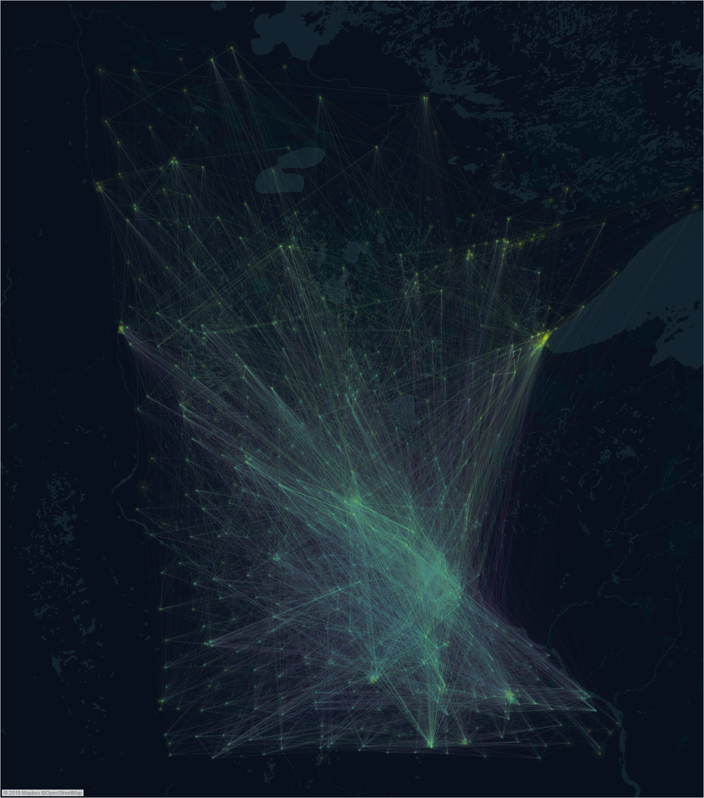

# Freight-O-D

Every year, the Metropolitan Council receives funds from the state transportation agency, MnDOT, for highway investments in the [7-county metro area](https://metrocouncil.org/About-Us/Who-We-Are/The-Twin-Cities-region.aspx).  To justify continued investment in the metro, and to demonstrate the importance of metro highways to greater Minnesota's freight fleets and transportation from farms and townships to distribution centers, several [StreetLight data](https://www.streetlightdata.com/) analyses were run.  The first analysis looked at heavy-duty freight flows in four months of the year, with Minnesota tracts as both the origins and the destinations.  The second analysis looked at heavy-duty freight flows in all months of the year, with Minnesota counties as both the origins and destinations.  The intent of these analyses was to enable examination of areas in Minnesota where heavy-duty freight vehicles were consistently stopping.  In both analyses, metro tracts and metro counties had some of the highest volume of freight flow trip ends in the state.

## Contributors

* Dave Burns (david.burns@metc.state.mn.us)
* Nicole Sullivan (nicole.sullivan@metc.state.mn.us)
